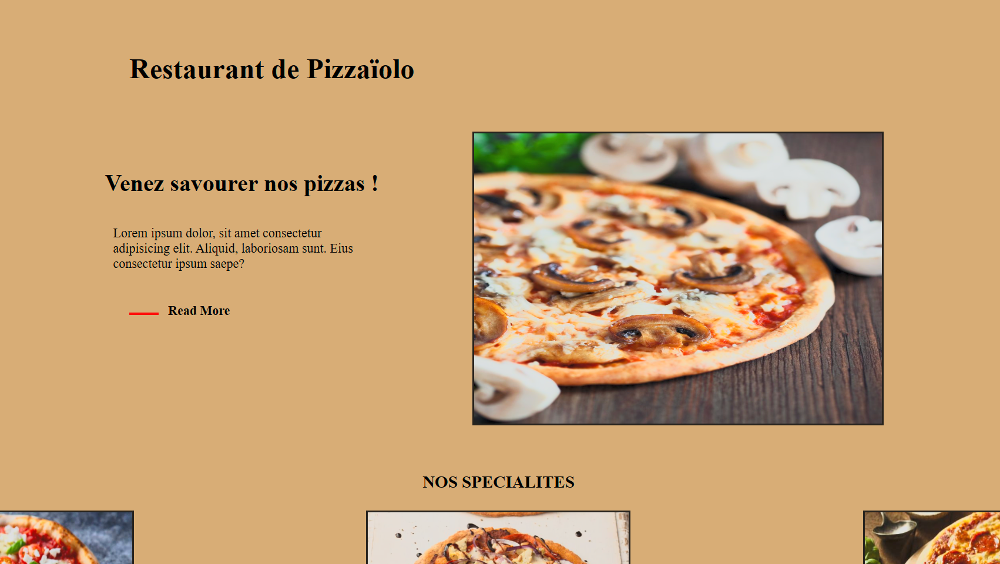

<h1 align="center">Welcome to Restaurant Pizzas 👋</h1>

  

### Création d'un site Web pour un restaurant de pizzas.

### Utilisation du langage HTML et CSS (Flexbox)

#### "Des MAJ sont prévus pour améliorer ce projet"

### ✨ [Demo](https://dev-it-seb.github.io/Home-Page-Pizzas/)

  

## Author

👤 **Sebastien C.**

* Github: [@Dev-IT-Seb](https://github.com/Dev-IT-Seb)

## Show your support

Give a ⭐️ if this project helped you!

***
_This README was generated with ❤️ by [readme-md-generator](https://github.com/kefranabg/readme-md-generator)_